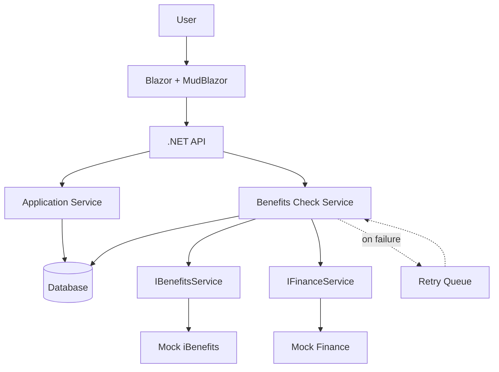
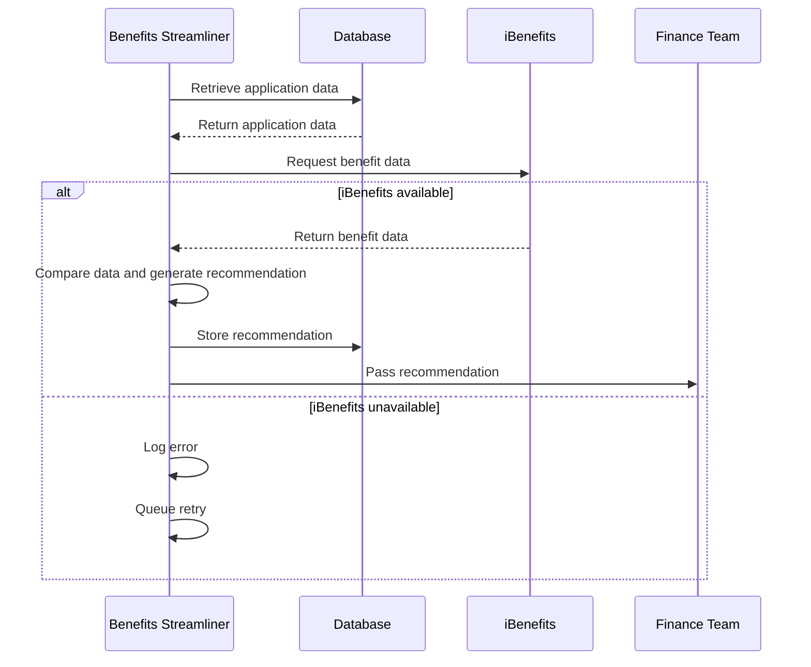

# Benefits Streamliner

A skinny vertical slice (proof of architecture) for the Benefits Streamliner project. It proves one complete path works end to end:

**Blazor UI → .NET API → Database → Integration layer → Mock iBenefits → Comparison → Recommendation → Database → Finance**

This is a prototype, not the production system. It uses a mock iBenefits service and a mock Finance service. Both sit behind interfaces so real implementations can replace them later without touching the UI or core logic.

## What it does

1. A user fills out a simplified benefits application in a Blazor page (MudBlazor UI).
2. The page posts it to the .NET API, which validates it and saves it to the database.
3. The API generates a unique application ID (`APP-000001`, `APP-000002`, ...) and returns it. The UI displays it.
4. The system calls `IBenefitsService` (backed by a mock) to get benefit data.
5. Application data is compared against the iBenefits data and a recommendation (Eligible / Not Eligible, with a reason) is generated.
6. The recommendation is saved to the database and passed to `IFinanceService`.
7. If iBenefits is unavailable, the error is logged and a retry is queued. The app does not crash, and the user sees a useful status.

## Tech stack

| Layer | Technology |
|---|---|
| UI | Blazor (Interactive Server) + MudBlazor |
| API | ASP.NET Core Web API (.NET 8) |
| Data access | Entity Framework Core 8 |
| Database | SQL Server / SQL Server Express (MySQL and SQLite also supported) |
| Tests | xUnit |

## Architecture



### Compare against iBenefits (sequence)



## Solution structure

```
BenefitsStreamliner/
├── BenefitsStreamliner.Core/    Models, DTOs, interfaces, recommendation logic
├── BenefitsStreamliner.Api/     Controllers, services, EF Core DbContext, migrations
├── BenefitsStreamliner.Web/     Blazor pages, MudBlazor UI, API client
└── BenefitsStreamliner.Tests/   Unit tests for the recommendation logic
```

Key pieces:

- `IBenefitsService` / `MockBenefitsService`: the iBenefits integration abstraction and its mock.
- `IFinanceService` / `MockFinanceService`: the Finance hand-off abstraction and its mock (logs the recommendation).
- `BenefitsCheckService`: runs the compare workflow and handles the unavailable path.
- `RetryQueue` / `RetryWorker`: in-memory retry queue drained by a background service.
- `RecommendationLogic`: simple, pure comparison logic.

## Prerequisites

- [.NET 8 SDK](https://dotnet.microsoft.com/download)
- SQL Server or SQL Server Express (or MySQL 8, or nothing if you use SQLite)
- `dotnet-ef` tool: `dotnet tool install --global dotnet-ef`
- Git

## Setup

### 1. Clone

```bash
git clone https://github.com/xavion-git/BenefitsStreamliner.git
cd BenefitsStreamliner
```

### 2. Configure the database

Connection strings are **not** stored in the repo. Set them with user-secrets from the API project:

```powershell
cd BenefitsStreamliner.Api
dotnet user-secrets init
dotnet user-secrets set "Database:Provider" "SqlServer"
dotnet user-secrets set "ConnectionStrings:Default" "Server=localhost\SQLEXPRESS;Database=BenefitsStreamliner;Trusted_Connection=True;TrustServerCertificate=True"
cd ..
```

Change `Server=` to match your SQL Server instance name (the one you see when connecting in SSMS).

**Other providers**

| Provider | `Database:Provider` | Example connection string |
|---|---|---|
| SQL Server | `SqlServer` | `Server=localhost\SQLEXPRESS;Database=BenefitsStreamliner;Trusted_Connection=True;TrustServerCertificate=True` |
| MySQL | `MySql` (default) | `Server=localhost;Port=3306;Database=benefits_streamliner;User=bs_user;Password=<your-password>` |
| SQLite | `Sqlite` | `Data Source=benefits.db` |

Migrations are provider-specific. If you switch providers, delete `BenefitsStreamliner.Api/Migrations` and regenerate them (step 3).

### 3. Run migrations

```powershell
dotnet ef migrations add InitialCreate --project BenefitsStreamliner.Api
dotnet ef database update --project BenefitsStreamliner.Api
```

This creates the `BenefitsStreamliner` database with `Applications` and `Recommendations` tables. (The API also applies pending migrations on startup in development.)

### 4. Run the API

```powershell
dotnet run --project BenefitsStreamliner.Api --urls http://localhost:5100
```

### 5. Run the Blazor app (in a second terminal)

```powershell
dotnet run --project BenefitsStreamliner.Web --urls http://localhost:5200
```

Open <http://localhost:5200>.

The Web app finds the API through `ApiBaseUrl` in `BenefitsStreamliner.Web/appsettings.json` (default `http://localhost:5100/`).

### 6. Run the tests

```powershell
dotnet test
```

## How the mock iBenefits integration works

`MockBenefitsService` implements `IBenefitsService` and returns predictable data:

| Field | Value |
|---|---|
| Eligible | `true` |
| Benefit amount | $500 |
| Income limit | $60,000 |
| Minimum age | 18 |

It also simulates outages so the failure path can be demonstrated:

- **Last name `Unavailable`**: the first call fails, the retry succeeds.
- **Config flag `MockBenefits:AlwaysUnavailable = true`**: every call fails, so the retry queue gives up after 3 attempts and the application is marked `Error`.

To replace the mock with the real system later, write a `RealIBenefitsService : IBenefitsService` and change one line in `BenefitsStreamliner.Api/Program.cs`. Nothing else changes.

## Recommendation logic

`RecommendationLogic.Evaluate` compares the application against the iBenefits data:

- Not eligible if iBenefits reports no active benefit.
- Not eligible if the applicant is under the minimum age.
- Not eligible if income exceeds the income limit.
- Otherwise eligible, with the estimated benefit amount in the reason.

These criteria are placeholders for the prototype. Replace them with the team's agreed rules.

## Demo script

| # | Action | Expected result |
|---|---|---|
| 1 | Submit John Smith, DOB 2000-01-01, income 45000 | Green message with `APP-000001` |
| 2 | Query `SELECT * FROM Applications;` | Row exists, Status = `Completed` |
| 3 | Check the API console | Log line: mock iBenefits returned data |
| 4 | Check the UI | "Recommendation: Eligible" |
| 5 | Query `SELECT * FROM Recommendations;` | Row with `Recommendation` = `Eligible` |
| 6 | Check the API console | `[FINANCE] Received recommendation...` |
| 7 | Submit with income 90000 | "Not Eligible" with an income-limit reason |
| 8 | Submit with last name `Unavailable` | "Retry queued" message. Console shows an error and a warning |
| 9 | Wait about 15 seconds, click **Refresh Status** | Status becomes Completed with a recommendation |
| 10 | Set `MockBenefits:AlwaysUnavailable` to `true`, restart the API, submit | After 3 retries, Status = `Error` |

## Scope and known limitations

This is intentionally minimal. Out of scope for the prototype:

- Real iBenefits integration
- Full Finance system (the mock only logs)
- Authentication and authorization
- Durable retry queue (the in-memory queue is lost when the API restarts)
- Complex eligibility rules

Open question for the team: one acceptance criterion mentions a "Business Central sandbox" alongside the mock iBenefits. This prototype uses the mock iBenefits only.

## Security notes

- No passwords, API keys, or connection strings are committed. Local settings live in user-secrets or environment variables.
- `.gitignore` excludes `*.db` and `appsettings.Development.json`.
- Error responses to the UI are generic. Details go to the server logs only.

## Third-party libraries and licenses

| Library | Purpose | License |
|---|---|---|
| [MudBlazor](https://mudblazor.com) | UI components | MIT |
| [Entity Framework Core](https://github.com/dotnet/efcore) | Data access | MIT |
| [Pomelo.EntityFrameworkCore.MySql](https://github.com/PomeloFoundation/Pomelo.EntityFrameworkCore.MySql) | MySQL provider | MIT |
| [xUnit](https://xunit.net) | Testing | Apache 2.0 |

SQL Server, SQL Server Express, and MySQL are used as external database services and are not redistributed in this repository. Their licenses are set by their vendors. Check each project's repository or NuGet page to confirm license details before publishing.
